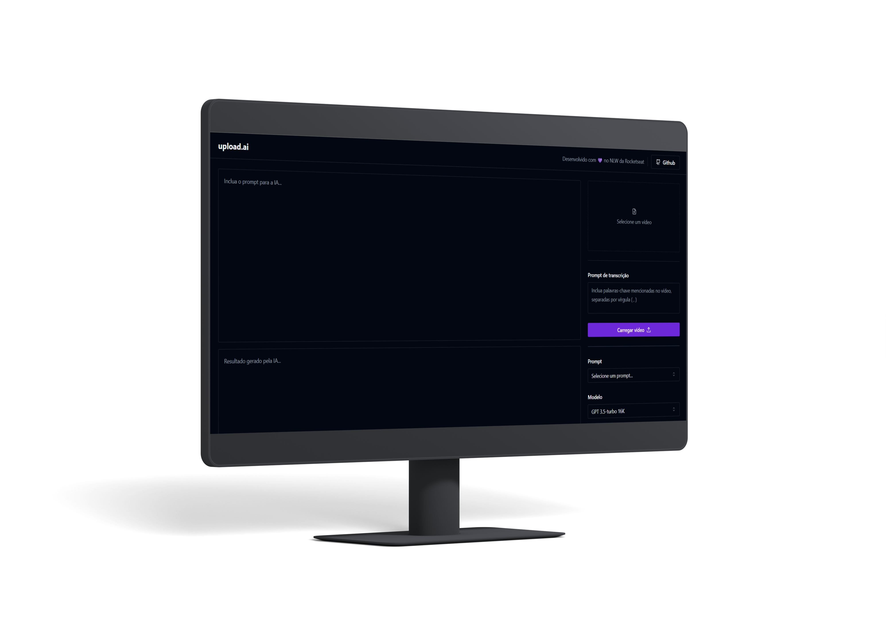

# upload-ai

<!-- 
 -->

## Ajustes e melhorias

O projeto ainda está em desenvolvimento e as próximas atualizações serão voltadas nas seguintes tarefas:

- [x] Configurações iniciais
- [x] UI do projeto
- [x] Backend do projeto
- [ ] Finalização do projeto

## ☕ Usando upload.ai

Para usar **upload.ai** web, siga estas etapas:

1. Clone o projeto na sua máquina. `git clone https://github.com/jusceliadesouza/upload-ai.git`
2. No terminal, utilize o comando `cd..` para voltar à raiz do projeto e redirecione para a pasta `web`
3. Instale as dependências utilizando `pnpm install`
4. Execute o projeto com `pnpm run dev`
5. Abra o endereço `http://localhost:5173/` no seu navegador favorito

Para usar o servidor, siga as seguintes etapas:

1. No terminal, vá até a pasta `server` usando o comando `cd server`
2. Instale as dependências do servidor utilizando `pnpm install`
3. Renomeie o arquivo `.env.example` para `.env` e preencha as variáveis de ambiente
4. Rode o servidor com `pnpm run dev`
5. Para acessar as informações no navegador, utilize o endereço `http://localhost:3333/`

## 📝 Licença

Esse projeto está sob licença. Veja o arquivo [LICENSE](LICENSE) para mais detalhes.

[⬆️ Voltar ao topo](#upload-ai)
