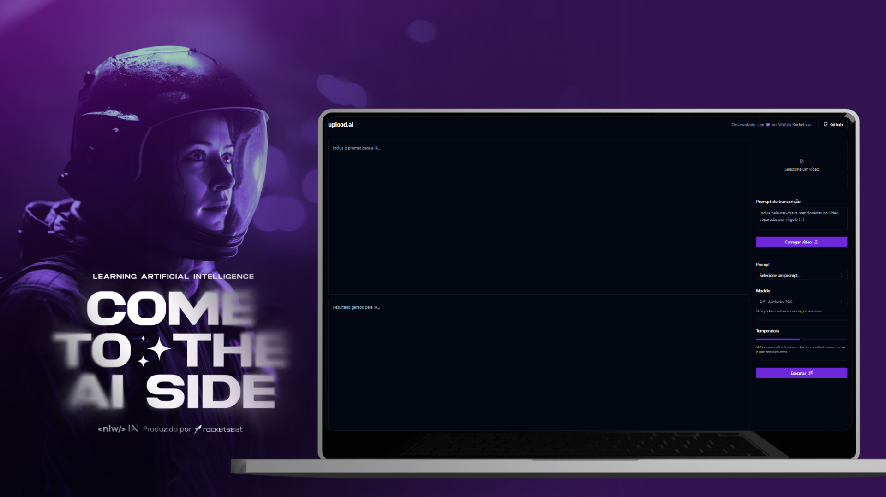

# upload-ai

<!--  -->
<!-- 
 -->

## 📝 Índice

- [Sobre](#🤖-sobre)
  - [O que é a NLW IA?](#o-que-é-a-nlw-ia)
  - [O que é a OpenAI?](#o-que-é-a-openai)
  - [O que é o upload.ai?](#o-que-é-o-uploadai)
  - [Aprendizado](#📚-aprendizado)
  - [Assista ao vídeo de apresentação do projeto](#assista-ao-vídeo-de-apresentação-do-projeto)
- [Tecnologias](#tecnologias)
  - [Frontend](#frontend)
  - [Backend](#backend)
- [Ajustes e melhorias](#ajustes-e-melhorias)
- [Pré-requisitos](#pré-requisitos)
  - [Ferramentas](#🛠️-ferramentas)
  - [Variáveis de ambiente](#🔑-variáveis-de-ambiente)
- [Usando upload.ai](#usando-uploadai)
  - [Usando o web](#🌐-usando-o-web)
  - [Usando a API](#📡-usando-a-api)
- [Licença](#licença)

## 🤖 Sobre

### O que é a NLW IA?

A NLW IA é um evento online, gratuito, oferecido pela [Rocketseat](https://rocketseat.com.br), com muito conteúdo prático, desafios e hacks que vão te ajudar a dar o próximo passo na sua evolução como programador. O evento aconteceu entre os dias 12 e 14 de setembro de 2023.

### O que é a OpenAI?

A OpenAI é uma empresa de pesquisa de inteligência artificial fundada por Elon Musk, Sam Altman e outros. A missão declarada da empresa é promover e desenvolver inteligência artificial amigável para beneficiar a humanidade como um todo. [Wikipédia](https://pt.wikipedia.org/wiki/OpenAI)

### O que é o upload.ai?

O **upload.ai** é uma aplicação web que utiliza a API da OpenAI para gerar títulos e descrições a partir de um vídeo escolhido pelo usuário. O vídeo, assim que enviado, é convertido para MP3 e, a partir daí, a aplicação transcreve o conteúdo do vídeo, enviando o resultado final para o usuário, de acordo com o prompt definido.

### 📚 Aprendizado

Durante o evento, aprendemos a utilizar a API da OpenAI, a criar um servidor com Fastify e a utilizar o Vercel AI SDK para integrar o backend com o frontend.

### Assista ao vídeo de apresentação do projeto

> Clique na imagem para assistir ao vídeo de apresentação do projeto.

## 🚀 Tecnologias

O projeto foi desenvolvido utilizando as seguintes tecnologias:

### Frontend

- [Vite](https://vitejs.dev/) (Servidor de desenvolvimento local)
- [React](https://reactjs.org/) (Biblioteca Frontend JavaScript)
- [TypeScript](https://www.typescriptlang.org/) (Linguagem de programação)
- [TailwindCSS](https://tailwindcss.com/) (Framework CSS)
- [Shadcn/UI](https://shadcn.github.io/ui/) (Componentes)
- [Lucide React](https://lucide.dev/guide/packages/lucide-react) (Ícones)
- [ffmpeg](https://ffmpeg.org/) (Conversão de vídeo)
- [Axios](https://axios-http.com/) (Requisições HTTP)
- [Vercel AI SDK](https://vercel.com/blog/introducing-the-vercel-ai-sdk) (SDK)

> O projeto foi desenvolvido utilizando o **Vite**, que é um bundler que utiliza o ESM (ECMAScript Modules) para importar os módulos. Por isso, o projeto **NÃO** é compatível com o Internet Explorer.

### Backend

- [pnpm](https://pnpm.io/) (Gerenciador de pacotes)
- [Node.js](https://nodejs.org/en/) (Ambiente de execução)
- [TypeScript](https://www.typescriptlang.org/) (Linguagem de programação)
- [Fastify](https://www.fastify.io/) (Framework web)
- [Fastify CORS](https://github.com/fastify/fastify-cors) (Plugin)
- [Fastify Multipart](https://github.com/fastify/fastify-multipart) (Plugin)
- [Zod](https://zod.dev/) (Validação de dados)
- [OpenAI API](https://platform.openai.com/) (API)
- [Vercel AI SDK](https://vercel.com/blog/introducing-the-vercel-ai-sdk) (SDK)

> O projeto foi desenvolvido utilizando o **pnpm**, que é um gerenciador de pacotes que utiliza o ESM (ECMAScript Modules) para importar os módulos. Por isso, a API **NÃO** é compatível com o Internet Explorer.

## Ajustes e melhorias

O projeto ainda está em desenvolvimento e as próximas atualizações serão voltadas nas seguintes tarefas:

- [x] Configurações iniciais do projeto
- [x] UI do projeto
- [x] API do projeto
- [x] Integração do backend com o frontend
- [ ] Deploy do projeto
- [ ] Adicionar suporte para formatos de áudio
- [ ] Adicionar suporte para URL de vídeo

> Você pode sugerir novas tarefas abrindo uma [issue](https://github.com/jusceliadesouza/upload-ai/issues/new) no repositório.

## Pré-requisitos

### 🛠️ Ferramentas

Para utilizar o **upload.ai** você precisará ter instalado em sua máquina as seguintes ferramentas:

- [Git](https://git-scm.com)
- [Node.js](https://nodejs.org/en/)
- [pnpm](https://pnpm.io/)
- Além disso, é bom ter um editor para trabalhar com o código, como o [VSCode](https://code.visualstudio.com/)

> Você pode utilizar o [npm](https://www.npmjs.com/) no lugar do [pnpm](https://pnpm.io/), mas é recomendado utilizar o [pnpm](https://pnpm.io/) para instalar as dependências do projeto.

### 🔑 Variáveis de ambiente

Também será necessário ter as seguintes chaves de API:

- [OpenAI API Key](https://platatform.openai.com/)

> Para obter as chaves de API, você precisará criar uma conta na [OpenAI](https://platatform.openai.com/).

## ☕ Usando upload.ai

### 🌐 Usando o web

Para usar **upload.ai** web, siga estas etapas:

1. Clone o projeto na sua máquina. `git clone https://github.com/jusceliadesouza/upload-ai.git`
2. No terminal, utilize o comando `cd..` para voltar à raiz do projeto e redirecione para a pasta `web`
3. Instale as dependências utilizando `pnpm install`
4. Execute o projeto com `pnpm run dev`
5. Abra o endereço `http://localhost:5173/` no seu navegador favorito

### 📡 Usando a API

Para usar a **api**, siga as seguintes etapas:

1. No terminal, vá até a pasta `api` usando o comando `cd api`
2. Instale as dependências da api utilizando `pnpm install`
3. Renomeie o arquivo `.env.example` para `.env` e preencha com as suas variáveis de ambiente.
4. Rode o servidor com `pnpm run dev`
5. Para acessar as informações no navegador, utilize o endereço `http://localhost:3333/`

> Você pode utilizar o [Insomnia](https://insomnia.rest/) para testar as rotas da API.

## 📝 Licença

Esse projeto está sob a licença MIT. Acesse o arquivo [LICENSE](LICENSE) para mais detalhes.

---

  
  
  
  

[⬆️ Voltar ao topo](#upload-ai)
