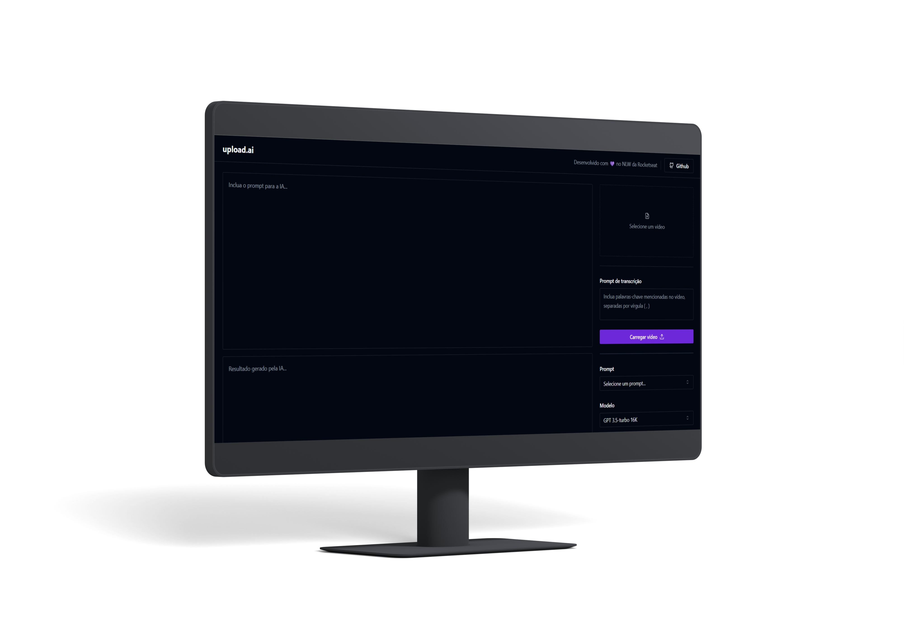

# upload-ai

<!-- 
 -->

## Ajustes e melhorias

O projeto ainda está em desenvolvimento e as próximas atualizações serão voltadas nas seguintes tarefas:

- [x] Configurações iniciais
- [x] UI do projeto
- [ ] Backend do projeto
<!-- 
- [ ] Tarefa 4
- [ ] Tarefa 5 
-->

## ☕ Usando upload.ai

Para usar upload.ai, siga estas etapas:

1. Instale as dependências utilizando `pnpm install`
2. Execute o projeto com `pnpm run dev`
3. Abra o endereço `http://localhost:5173/` no seu navegador favorito

## 📝 Licença

Esse projeto está sob licença. Veja o arquivo [LICENSE](LICENSE) para mais detalhes.
